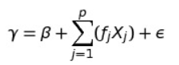

# Future Price Prediction
This project is implemented for analysis of product's prices over the series of time in different regions. The exploratory analysis of data is done through vizualizations using different graphs and plots of matplotplib and seaborn.
After the analysis of product's prices we predict the the price of product for next 365. The time series prediction is done using the the state of art model fbprophet which captures the trend followed in the product's price in past.
We will observe that the prediction is very different for specific regions comapred to overall regions. The project is demonstrated on a webpage which is built using a cool python framework Streamlit.

> The live version of project can be accessed by clicking here [here](https://price-prediction2.herokuapp.com/). Hope these visualizations and predictions excite you about the matplotlib, Seaborn and fbprophet model.

## Installing dependencies
The version of dependencics used are mentioned in the requirements.txt file of this repository.

## About data
* <b>Date</b>: The date of the observation
* <b>AveragePrice</b>: the average price of a single avocado
* <b>type</b>: conventional or organic
* <b>year</b>: the year
* <b>Region</b>: the city or region of the observation
* <b>Total Volume</b>: Total number of avocados sold
* <b>4046</b>: Total number of avocados with PLU 4046 sold
* <b>4225</b>: Total number of avocados with PLU 4225 sold
* <b>4770</b>: Total number of avocados with PLU 4770 sold

## About Facebook Prophet
* Prophet is open source software released by Facebook's Core Data Science Team.
* Prophet is a procedure for forecasting time series data based on an additive model where non-linear trends are fit with yearly, weekly, and daily seasonality, plus holiday effects.
* Prophet works best with time series that have strong seasonal effects and several seasons of historical data.
* Prophet implements an additive regression model with four elements:
  * A piecewise linear, prophet automatically picks up change points in the data and identifies any change in trends.
  * A yearly seasonal component modeled using Fourier seris.
  * A weekly seasonal component
  * A holiday list that can be manually provided.
  
 * Additive regression models takes the form:

      
      
 * The functions fj(Xj) are unknown smoothing functions fit from the data
 
 ## Running Code
 Type in cmd or terminal
 > streamlit run app.py
 
 # About Me
 You can check my other projects on:
* [Github](https://github.com/riturajkush)
* [LinkedIn](https://www.linkedin.com/in/rajkush/)
 
